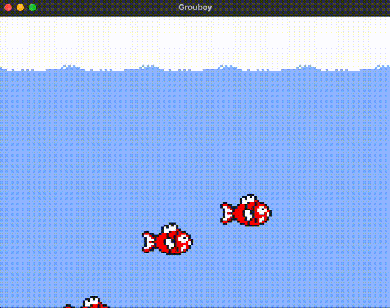
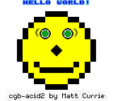

<p align="center">
  <strong>GROUBOY</strong><br>
  A modern C++ Game Boy Color emulator
</p>

<p align="center">
  <a href="https://github.com/arthurgiroux/grouboy/actions/workflows/ci.yml"></a>
  <a href="https://github.com/arthurgiroux/grouboy/actions/workflows/wasm.yml"></a>
  <a href="https://choosealicense.com/licenses/mit/"></a>
</p>

<p align="center">
  <a href="https://arthurgiroux.github.io/grouboy/"><strong>Try it in your browser</strong></a>
</p>

---

Grouboy is an educational Game Boy Color emulator built in modern C++. It compiles natively on Windows, macOS, and Linux, and also runs in the browser via WebAssembly.

The focus is on clean, readable code with thorough documentation and test coverage rather than cycle-perfect accuracy.

## Demo

| Pokemon Silver | Zelda | Mario |
|:-:|:-:|:-:|
|  |  |  |

**[Play in your browser](https://arthurgiroux.github.io/grouboy/)** -- load your own ROM or try the bundled demo.

## Features

- **CPU** -- All instructions implemented
- **PPU** -- Accurate pixel FIFO rendering
  - Separate background/window and sprite FIFOs
  - Proper sprite priority handling (DMG and CGB)
  - Window mid-scanline triggering
  - SCX fine scrolling
- **Sprites** -- 8x8 and 8x16 modes
- **Sound** -- All 4 channels (square, wave, noise)
- **Memory Bus Controllers** -- MBC1, MBC2, MBC3
- **Game Boy Color** -- Color palettes, VRAM banking, CGB priority rules
- **Timer, Serial, Inputs**
- **Cross-platform GUI** via SDL2
- **WebAssembly** build with a React/Next.js frontend

### Future work

- Sub-instruction CPU timing
- Additional MBCs
- GBC double-speed mode

## Controls

| Keyboard | Game Boy |
|----------|----------|
| Arrow keys | D-Pad |
| A | A |
| B | B |
| Enter | Start |
| Space | Select |

## Getting started

### Native (Windows / macOS / Linux)

Requires CMake and a C++17 compiler. SDL2 and GoogleTest are fetched automatically.

```bash
mkdir -p build && cd build
cmake ..
cmake --build .
```

### WebAssembly

Requires [Emscripten](https://emscripten.org/).

```bash
mkdir -p build && cd build
emcmake cmake ..
cmake --build .
cmake --install .
```

The install target copies the compiled WASM module to the frontend directory. Then run the frontend locally:

```bash
cd web/grouboy
npm install
npm run dev
```

### Running tests

```bash
cd build
ctest --output-on-failure
```

## Test coverage

<details>
<summary>Blargg's test suite</summary>

| Category | Test | Status |
|----------|------|:------:|
| CPU Instructions | 01 - Special | :white_check_mark: |
| CPU Instructions | 02 - Interrupts | :white_check_mark: |
| CPU Instructions | 03 - Op SP, HL | :white_check_mark: |
| CPU Instructions | 04 - Op r,imm | :white_check_mark: |
| CPU Instructions | 05 - Op rp | :white_check_mark: |
| CPU Instructions | 06 - LD r,r | :white_check_mark: |
| CPU Instructions | 07 - JR,JP,Call,RET,RST | :white_check_mark: |
| CPU Instructions | 08 - Misc Instrs | :white_check_mark: |
| CPU Instructions | 09 - Op r,r | :white_check_mark: |
| CPU Instructions | 10 - Bits Ops | :white_check_mark: |
| CPU Instructions | 11 - Op a,(hl) | :white_check_mark: |
| Instructions Timing | Instr Timing | :white_check_mark: |
| Sound | 01 - Registers | :white_check_mark: |
| Sound | 02 - Len ctr | :white_check_mark: |
| Sound | 03 - Trigger | :x: |
| Sound | 04 - Sweep | :white_check_mark: |
| Sound | 05 - Sweep details | :x: |
| Sound | 06 - Overflow on trigger | :white_check_mark: |
| Sound | 07 - Len sweep period sync | :x: |
| Sound | 08 - Len ctrl during power | :x: |
| Sound | 09 - Wave read while on | :x: |

</details>

<details>
<summary>Acid2 test</summary>

| Reference | Status |
|-----------|:------:|
|  | :white_check_mark: |
|  | :white_check_mark: |

</details>

<details>
<summary>Mooneye test suite</summary>

| Category | Test | Status |
|----------|------|:------:|
| CPU Instructions | DAA | :white_check_mark: |
| Bits | MEM OAM | :white_check_mark: |
| Bits | Reg F | :white_check_mark: |
| Bits | unused_hwio-GS | :white_check_mark: |
| OAM DMA | Basic | :white_check_mark: |
| Timer | Div Write | :white_check_mark: |
| Timer | Rapid toggle | :x: |
| Timer | Tim00 | :white_check_mark: |
| Timer | Tim00 Div trigger | :x: |
| Timer | Tim01 | :white_check_mark: |
| Timer | Tim01 Div trigger | :x: |
| Timer | Tim10 | :white_check_mark: |
| Timer | Tim10 Div trigger | :x: |
| Timer | Tim11 | :white_check_mark: |
| Timer | Tim11 Div trigger | :x: |

</details>

## Dependencies

- [SDL2](https://www.libsdl.org/) -- GUI and audio
- [SDL2_ttf](https://wiki.libsdl.org/SDL2_ttf/FrontPage) -- Font rendering
- [spdlog](https://github.com/gabime/spdlog) -- Logging
- [GoogleTest](https://github.com/google/googletest) -- Testing (fetched via CMake)
- [Emscripten](https://emscripten.org/) -- WebAssembly compilation
- [Next.js](https://nextjs.org/) / [React](https://react.dev/) -- Web frontend

## References

- [Game Boy opcode table](https://izik1.github.io/gbops/index.html)
- [Pan Docs](https://gbdev.io/pandocs/)
- [Game Boy dev wiki](https://gbdev.gg8.se/wiki/articles/Main_Page)
- [Game Boy Programming Manual](https://archive.org/details/GameBoyProgManVer1.1/mode/2up?view=theater)

## Contributing

Pull requests are welcome. For major changes, please open an issue first to discuss what you would like to change. Please make sure to update tests as appropriate.

## License

[MIT](https://choosealicense.com/licenses/mit/)
