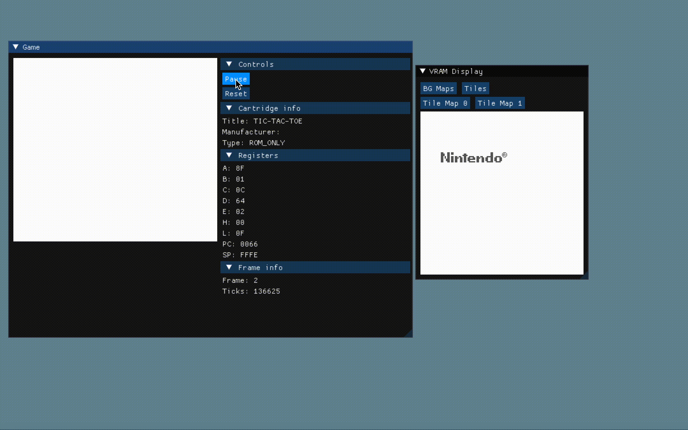
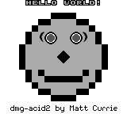

# C++ Gameboy Emulator [](https://github.com/arthurgiroux/gbemulator/actions/workflows/ci.yml/badge.svg)

This is an educative implementation of a Gameboy Emulator made in C++.

## Features

Here's what's implemented so far:

* Memory abstraction
* All CPU instructions
* PPU abstraction
* GUI
* Sprites
* Inputs
* Timer
* Serial
* Memory Bus Controller
    * MBC1
    * MBC2
    * MBC3

Future work:

* Other MBCs
* Sound

## Input mapping

| Keyboard input | Gameboy input |
|----------------|---------------|
| Up Arrow       | Up            |
| Down Arrow     | Down          |
| Left Arrow     | Left          |
| Right Arrow    | Right         |
| Enter          | Start         |
| Space bar      | Select        |
| A              | A             |
| B              | B             |

## Demo



## Dependencies

This project relies on Qt 6.4 for the GUI, GoogleTest for the testing suite, and sdplog for logging.

## Compilation

In order to compile the project, you will need
to [download and install Qt 6.4](https://doc.qt.io/qt-6/get-and-install-qt.html).

The project can be compiled using CMake, it will automatically retrieve some dependencies like GoogleTest.

```
mkdir -p build && cd build/
cmake ..
cmake --build .
```

## Tests

The emulator is tested using various test suites and automated test cases for all components.
You can find the test report in the Github actions.

Blaarg's test coverage:

| Category            | Test Name               | Pass/Fail           |
|---------------------|-------------------------|---------------------|
| CPU Instructions    | 01 - Special            | :white_check_mark:	 |
| CPU Instructions    | 02 - Interrupts         | :white_check_mark:	 |
| CPU Instructions    | 03 - Op SP, HL          | :white_check_mark:	 |
| CPU Instructions    | 04 - Op r,imm           | :white_check_mark:	 |
| CPU Instructions    | 05 - Op rp              | :white_check_mark:	 |
| CPU Instructions    | 06 - LD r,r             | :white_check_mark:	 |
| CPU Instructions    | 07 - JR,JP,Call,RET,RST | :white_check_mark:	 |
| CPU Instructions    | 08 - Misc Instrs        | :white_check_mark:	 |
| CPU Instructions    | 09 - Op r,r             | :white_check_mark:	 |
| CPU Instructions    | 10 - Bits Ops           | :white_check_mark:	 |
| CPU Instructions    | 11 - Op a,(hl)          | :white_check_mark:	 |
| CPU Instructions    | 07 - JR,JP,Call,RET,RST | :white_check_mark:	 |
| Instructions Timing | Instr Timing            | :white_check_mark:	 |

[Acid2 test](https://github.com/mattcurrie/dmg-acid2):

| Reference image                                      | Pass/Fail          |
|------------------------------------------------------|--------------------|
|  | :white_check_mark: |

[Mooneye test suite](https://github.com/Gekkio/mooneye-test-suite):

| Category            | Test Name               | Pass/Fail          |
|---------------------|-------------------------|--------------------|
| CPU Instructions    | DAA                     | :white_check_mark: |

## Contributing

Pull requests are welcome. For major changes, please open an issue first to discuss what you would like to change.

Please make sure to update tests as appropriate.

## License

[MIT](https://choosealicense.com/licenses/mit/)