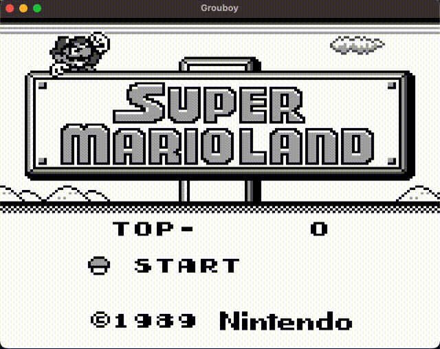

# GrouBoy - a modern C++ Game Boy emulator [](https://github.com/arthurgiroux/gbemulator/actions/workflows/ci.yml/badge.svg)

This is an educational implementation of a Game Boy Emulator, developed using modern C++.
The primary aim of this project is to provide an implementation that is easy to read, well architecture, with extensive
code documentation and testing.
It is designed to function seamlessly on Windows, Mac, and Linux.

## Features

The following features are implemented:

* Memory abstraction
* All CPU instructions
* PPU abstraction
* GUI
* Sprites
* Inputs
* Timer
* Serial
* Memory Bus Controller
    * MBC1
    * MBC2
    * MBC3
* Sound
    * Channel 1
    * Channel 2
    * Channel 3
    * Channel 4

Future work:

* Sub-instruction CPU timing
* FIFO PPU
* Other MBCs

## Input mapping

| Keyboard input | Gameboy input |
|----------------|---------------|
| Up Arrow       | Up            |
| Down Arrow     | Down          |
| Left Arrow     | Left          |
| Right Arrow    | Right         |
| Enter          | Start         |
| Space bar      | Select        |
| A              | A             |
| B              | B             |

## Demo

| Name    | Output                          |
|---------|---------------------------------|
| Zelda   |    |
| Mario   |    |
| Pokemon |  |

## Dependencies

This project relies on SDL for the GUI, GoogleTest for the testing suite, and spdlog for logging.

## Compilation

The project can be compiled using CMake, it will automatically retrieve some dependencies like SDL and GoogleTest.

```
mkdir -p build && cd build/
cmake ..
cmake --build .
```

## Tests

The emulator is tested using various test suites and automated test cases for all components.
You can find the test report in the Github actions.

Blargg's test coverage:

| Category            | Test Name                  | Pass/Fail           |
|---------------------|----------------------------|---------------------|
| CPU Instructions    | 01 - Special               | :white_check_mark:	 |
| CPU Instructions    | 02 - Interrupts            | :white_check_mark:	 |
| CPU Instructions    | 03 - Op SP, HL             | :white_check_mark:	 |
| CPU Instructions    | 04 - Op r,imm              | :white_check_mark:	 |
| CPU Instructions    | 05 - Op rp                 | :white_check_mark:	 |
| CPU Instructions    | 06 - LD r,r                | :white_check_mark:	 |
| CPU Instructions    | 07 - JR,JP,Call,RET,RST    | :white_check_mark:	 |
| CPU Instructions    | 08 - Misc Instrs           | :white_check_mark:	 |
| CPU Instructions    | 09 - Op r,r                | :white_check_mark:	 |
| CPU Instructions    | 10 - Bits Ops              | :white_check_mark:	 |
| CPU Instructions    | 11 - Op a,(hl)             | :white_check_mark:	 |
| Instructions Timing | Instr Timing               | :white_check_mark:	 |
| Sound               | 01 - Registers             | :white_check_mark:	 |
| Sound               | 02 - Len ctr               | :white_check_mark:	 |
| Sound               | 03 - Trigger               | :x:	                |
| Sound               | 04 - Sweep                 | :white_check_mark:	 |
| Sound               | 05 - Sweep details         | :x:	                |
| Sound               | 06 - Overflow on trigger   | :white_check_mark:	 |
| Sound               | 07 - Len sweep period sync | :x:	                |
| Sound               | 08 - Len ctrl during power | :x:	                |
| Sound               | 09 - Wave read while on    | :x:	                |

[Acid2 test](https://github.com/mattcurrie/dmg-acid2):

| Reference image                                      | Pass/Fail          |
|------------------------------------------------------|--------------------|
|  | :white_check_mark: |

[Mooneye test suite](https://github.com/Gekkio/mooneye-test-suite):

| Category         | Test Name         | Pass/Fail          |
|------------------|-------------------|--------------------|
| CPU Instructions | DAA               | :white_check_mark: |
| Bits             | MEM OAM           | :white_check_mark: |
| Bits             | Reg F             | :white_check_mark: |
| Bits             | unused_hwio-GS    | :white_check_mark: |
| OAM DMA          | Basic             | :white_check_mark: |
| Timer            | Div Write         | :white_check_mark: |
| Timer            | Rapid toggle      | :x:                |
| Timer            | Tim00             | :white_check_mark: |
| Timer            | Tim00 Div trigger | :x:                |
| Timer            | Tim01             | :white_check_mark: |
| Timer            | Tim01 Div trigger | :x:                |
| Timer            | Tim10             | :white_check_mark: |
| Timer            | Tim10 Div trigger | :x:                |
| Timer            | Tim11             | :white_check_mark: |
| Timer            | Tim11 Div trigger | :x:                |

## Reference

* <https://izik1.github.io/gbops/index.html>
* <https://gbdev.io/pandocs/>
* <https://gbdev.gg8.se/wiki/articles/Main_Page>
* <https://archive.org/details/GameBoyProgManVer1.1/mode/2up?view=theater>

## Contributing

Pull requests are welcome. For major changes, please open an issue first to discuss what you would like to change.

Please make sure to update tests as appropriate.

## License

[MIT](https://choosealicense.com/licenses/mit/)